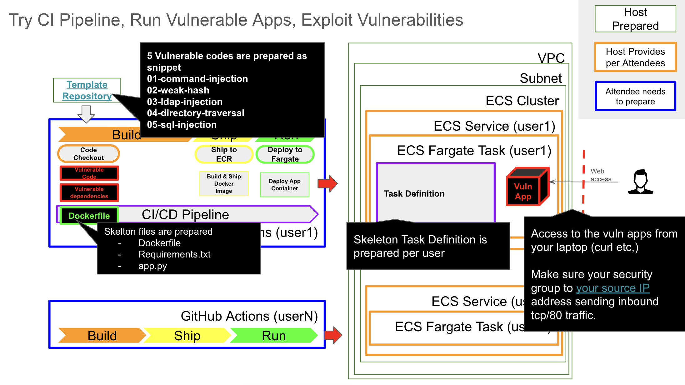
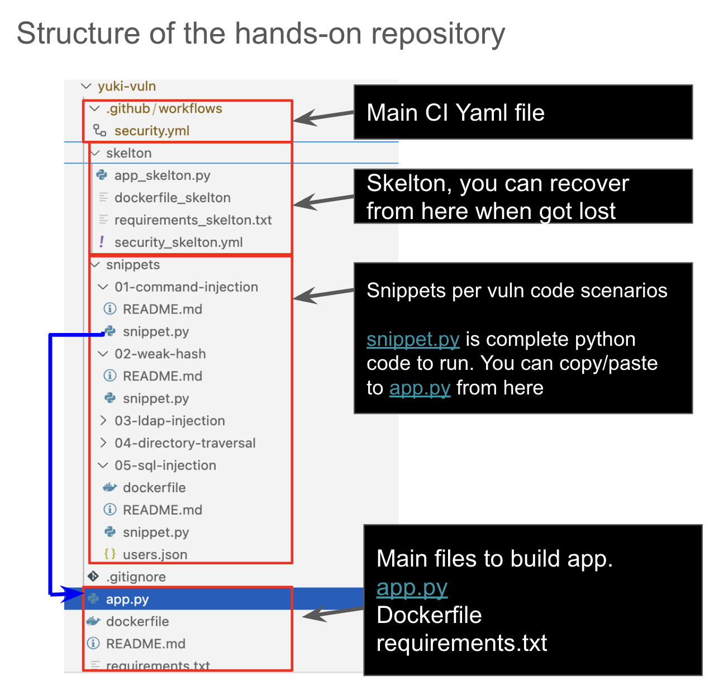

# Vulnerable Python App For Code Security Workshop

This simple Python/Flask app contains intentionally vulnerable code. You will analyze it using [Datadog Code Security](https://docs.datadoghq.com/code_security/) via GitHub Actions.

---

## 🚀 Workshop Overview

In this workshop, you will:

- Work with intentionally vulnerable Python code (Pick some CWEs from [OWASP Benchmark](https://owasp.org/www-project-benchmark/))
- Push commits to trigger GitHub Actions
- Run SCA (Software Composition Analysis) and SAST (Static Application Security Testing)
- Observe results in Datadog Code Security (SCA, SAST and more extensibly IAST, APP and API Protection)
- Fix vulnerabilities and verify the results

---

## 🛠 Repository Structure

```
.
├── .github/workflows/           
│       └── security.yml             # GitHub Actions workflow for CI and scanning
├── skelton/                         # Baseline Flask app to reset to clean state
├── snippets/                        # Vulnerable code snippets
│       ├── 01-command-injection/
│       ├── 02-weak-hash/
│       ├── 03-insecure-deserialization/
│       └── ... (more vulnerabilities)
├── app.py
├── dockerfile
├── requirements.txt
├── README.md (the file you are reading)
├── img/                             # image files to enrich this README                           
```

Each snippet is self-contained and can be copied into the root `app.py` as needed.

---

## 🧪 Getting Started

### 1. Create your own private repository using this template

Follow these steps to begin:

1. Navigate to the GitHub page of this repository in your browser.
2. Click the green **"Use this template"** button near the top right corner.
3. On the next screen:
   - Enter a name for your new repository (e.g., `my-vuln-app`).
   - **Select "Private"** under repository visibility.  
     This helps prevent accidental exposure of sensitive information, such as hardcoded credentials or API keys that might be added during the workshop.
   - Click **"Create repository from template"** to finish.

4. Once your new private repository has been created, copy its clone URL:
   - Click the green **"Code"** button
   - Select **"HTTPS"** and click the clipboard icon to copy the URL

5. Clone the repository to your local machine:

```bash
git clone https://github.com/YOUR_USERNAME/YOUR_PRIVATE_REPO.git
cd YOUR_PRIVATE_REPO
```

---

### 2. Integrate your repository with Datadog via GitHub App

Before configuring secrets or pushing code, link your GitHub repository with Datadog using the official GitHub App:

1. Go to the [Datadog GitHub App installation page](https://app.datadoghq.com/integrations/github/configuration).
2. Click **"+ Connect GitHub Account"**.
3. Choose GitHub account type, and add permissions required.
4. Click create GitHub App:
   - Configure GitHub App Name
   - Choose **"Only select repositories"** (recommended).
     - Select your newly created private repository.
   - Complete the installation.

> This integration allows Datadog to receive GitHub Actions scan results and display them in the Code Security dashboard.

---

### 3. Set GitHub Secrets

In your new **private** repository, go to **Settings > Secrets and variables > Actions**  
Set the following secrets:

| Name | Description |
|------|-------------|
| `DD_API_KEY` | Your Datadog API key |
| `DD_APP_KEY` | Your Datadog application key |
| `AWS_ACCESS_KEY_ID` | (For deployment) AWS credentials  (**hands-on host prepares a least privileged IAM user for CI for attendees**) |
| `AWS_SECRET_ACCESS_KEY` | (For deployment) AWS credentials (**hands-on host prepares a least privileged IAM user for CI for attendees**)|
| `AWS_REGION` | AWS region (e.g., `eu-west-1`) |
| `AWS_ACCOUNT_ID` | Your AWS account ID |
| `ECS_CLUSTER_NAME` | Target ECS cluster name  (**hands-on host informs the name of cluster**) |
| `ECS_SERVICE_NAME` | Target ECS service name (**hands-on host informs the name of service**)|
| `USER_ID` | A unique suffix to isolate your deployment (**hands-on host informs the USER_ID for attendees**)|

---

### 4. Set Repository Configuration

Before adding Datadog Code Security features (Static SCA/SAST), we want to exclude the unnecessary directories 
```
.
├── .github/workflows/           
│       └── security.yml             
├── skelton/                         
├── snippets/                        
```

To do that, go to [Code Security] > [Settings] > [Repository Settings](https://app.datadoghq.com/security/configuration/code-security/settings)
Scroll down to Repository Settings and select your private repository in the table.

Under the Repository Configuration add below code block to exclude these folders from SCA/SAST scanning
```
rulesets:
  # This ignores test files
  - python-security:
    ignore:
      - "**/snippets/**"
      - "**/skelton/**"
      - "**/.github/**"
      - "**/img/**"  
```

---
### 5. Start the CI/CD flow and verify baseline deployment

Before adding any vulnerabilities, first deploy the clean skeleton app to verify that your CI/CD pipeline is working correctly.

You can trigger the pipeline by making any commit and pushing it to GitHub. For example:

```bash
touch trigger.txt
git add trigger.txt
git commit -m "Initial trigger for CI"
git push
```

Or simply modify any file (like `README.md`) and push:

```bash
git commit -am "Test pipeline"
git push
```

Once you’ve pushed the change:

1. Go to your GitHub repository page.
2. Click on the **"Actions"** tab (top menu).
3. You should see a workflow run (e.g., "Build and Deploy to Fargate") triggered by your commit.
4. Click the workflow name to see detailed steps.
5. Ensure that each step (checkout, build, deploy, etc.) completes successfully with a green check mark.

---

### 6. Confirm the deployed application on AWS Fargate

To access your deployed Flask app, check the public IP address or DNS name of the ECS service:

1. Go to the [AWS Management Console](https://console.aws.amazon.com/).
2. Navigate to **ECS > Clusters**, then click on your cluster (name from `ECS_CLUSTER_NAME`).
3. In the **Services** tab, click on your service (name from `ECS_SERVICE_NAME`).
4. In the **Tasks** tab, click on a running task.
5. In the **Network** section and look for the **Public IP** information.
6. There you’ll find the **Public IPv4 address**. Click it to open your app in the browser.

> The app should show: `Flask app is running. Add your first vulnerability!`

---

Now you are ready to start the Code Security Hands-on! 🚀
You can try out vulnerable app snippets, make attack requests, check the vulnerability are exploitable.
  


### 7. Add Datadog Static SCA and SAST to GitHub Actions

### 8. Add Datadog Runtime SCA, IAST and AAP to ECS Task Definition


---
### Disclaimer
This repository is intended solely for educational and demonstration purposes related to application security.
It contains intentionally vulnerable code examples to help learners understand common software weaknesses and how to mitigate them.

Use this code at your own risk.

We do not guarantee the safety, reliability, or suitability of this repository for any production or non-training environment.
By using this material, you agree that the authors and contributors are not responsible for any damage, loss, or legal consequences that may result from misuse or unintended deployment of the contents.

Please ensure you use this repository in a safe, isolated, and authorized environment.